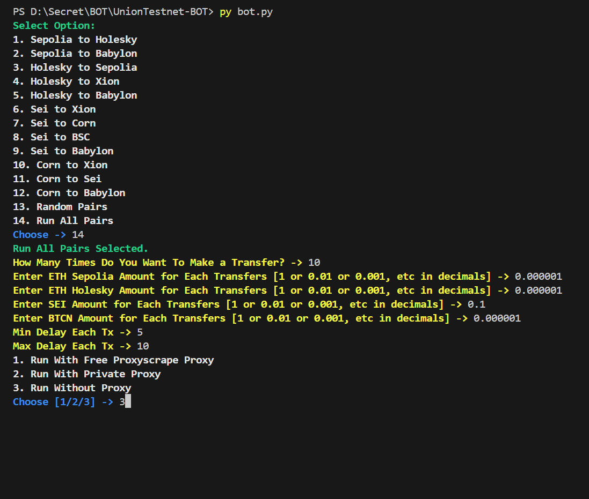

# Union Testnet BOT
Union Testnet BOT

- Register Here : [Union Testnet](https://app.union.build/)
- Signup With X
- Connect EVM (Use Metamask)
- Connect Cosmos (Use Keplr)
- Contact me if u want: [Vonssy](https://t.me/Anoraks_uneducate)
- Price? Only $5

## Features

<div style="text-align: center;">
  
</div>

## Requiremnets

- Make sure you have Python3.9 or higher installed and pip.
- [ETH Sepolia Faucet](https://cloud.google.com/application/web3/faucet/ethereum/sepolia)
- [ETH Holesky Faucet](https://cloud.google.com/application/web3/faucet/ethereum/holesky)
- [SEI Faucet](https://docs.sei.io/learn/faucet)
- [BTCN Faucet](https://faucet.conduit.xyz/corn-testnet-l8rm17uloq)

## Instalation

1. **Extract .ZIP:**
   ```bash
   unzip UnionTestnet-BOT.zip
   ```
   ```bash
   cd UnionTestnet-BOT
   ```

2. **Install Requirements:**
   ```bash
   pip install -r requirements.txt #or pip3 install -r requirements.txt
   ```

### Note: Check your web3, eth-account, eth-utils, and eth-abi library version first. If not same with version in requirements.txt, u must uninstall that library.
- **Check Library Version**
  ```bash
    pip show libary_name
  ```
- **Uninstall Library**
  ```bash
    pip uninstall libary_name
  ```
- **Install Library With Version**
  ```bash
    pip install libary_name==version

## Configuration

- **accounts.json:** You will find the file `accounts.json` inside the project directory. Make sure `accounts.json` contains data that matches the format expected by the script. Here are examples of file formats:
  ```json
    [
        {
            "PrivateKey": "your_evm_private_key_1",
            "XionAddress": "your_xion_address_1",
            "BabylonAddress": "your_babylon_address_1"
        },
        {
            "PrivateKey": "your_evm_private_key_2",
            "XionAddress": "your_xion_address_2",
            "BabylonAddress": "your_babylon_address_2"
        }
    ]
  ```

- **proxy.txt:** You will find the file `proxy.txt` inside the project directory. Make sure `proxy.txt` contains data that matches the format expected by the script. Here are examples of file formats:
  ```bash
    ip:port # Default Protcol HTTP.
    protocol://ip:port
    protocol://user:pass@ip:port
  ```

## Run

```bash
python bot.py #or python3 bot.py
```

## Buy Me a Coffee

- **EVM:** 0xe3c9ef9a39e9eb0582e5b147026cae524338521a
- **TON:** UQBEFv58DC4FUrGqinBB5PAQS7TzXSm5c1Fn6nkiet8kmehB
- **SOL:** E1xkaJYmAFEj28NPHKhjbf7GcvfdjKdvXju8d8AeSunf
- **SUI:** 0xa03726ecbbe00b31df6a61d7a59d02a7eedc39fe269532ceab97852a04cf3347

Thank you for visiting this repository, don't forget to contribute in the form of follows and stars.
If you have questions, find an issue, or have suggestions for improvement, feel free to contact me or open an *issue* in this GitHub repository.

**vonssy**